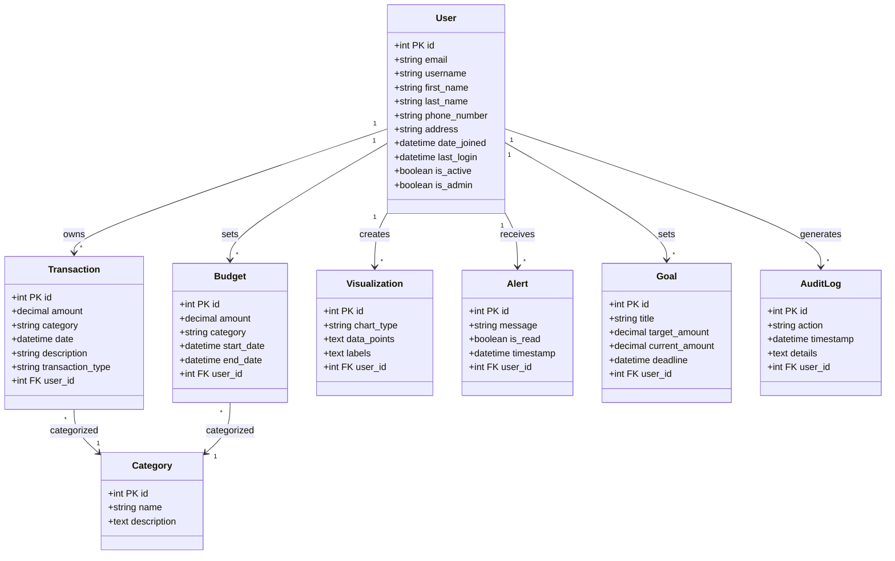

```mermaid
classDiagram
    class User {
        +int PK id
        +string email
        +string username
        +string first_name
        +string last_name
        +string phone_number
        +string address
        +datetime date_joined
        +datetime last_login
        +boolean is_active
        +boolean is_admin
    }

    class Transaction {
        +int PK id
        +decimal amount
        +string category
        +datetime date
        +string description
        +string transaction_type
        +int FK user_id
    }

    class Budget {
        +int PK id
        +decimal amount
        +string category
        +datetime start_date
        +datetime end_date
        +int FK user_id
    }

    class Visualization {
        +int PK id
        +string chart_type
        +text data_points
        +text labels
        +int FK user_id
    }

    class Alert {
        +int PK id
        +string message
        +boolean is_read
        +datetime timestamp
        +int FK user_id
    }

    class Category {
        +int PK id
        +string name
        +text description
    }

    class Goal {
        +int PK id
        +string title
        +decimal target_amount
        +decimal current_amount
        +datetime deadline
        +int FK user_id
    }

    class AuditLog {
        +int PK id
        +string action
        +datetime timestamp
        +text details
        +int FK user_id
    }

    User "1" --> "*" Transaction : owns
    User "1" --> "*" Budget : sets
    User "1" --> "*" Visualization : creates
    User "1" --> "*" Alert : receives
    User "1" --> "*" Goal : sets
    User "1" --> "*" AuditLog : generates
    Transaction "*" --> "1" Category : categorized
    Budget "*" --> "1" Category : categorized

```