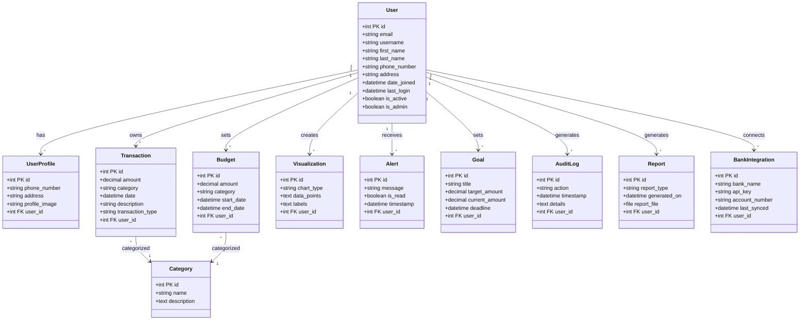

# Financial Transaction Monitoring & Analytics Tool Models

## User
Represents the primary user of the application.

| Field           | Type        | Description                                      |
|-----------------|-------------|--------------------------------------------------|
| `id`            | int         | Primary key, unique identifier for the user.    |
| `email`         | string      | User's email address.                            |
| `username`      | string      | Unique username chosen by the user.              |
| `first_name`    | string      | User's first name.                               |
| `last_name`     | string      | User's last name.                                |
| `phone_number`  | string      | User's contact phone number.                     |
| `address`       | string      | User's physical address.                         |
| `date_joined`   | datetime    | Timestamp of when the user joined the platform.  |
| `last_login`    | datetime    | Timestamp of the user's last login.              |
| `is_active`     | boolean     | Indicates whether the user's account is active.  |
| `is_admin`      | boolean     | Indicates whether the user has administrative privileges. |

---

## UserProfile
Contains additional profile details for users.

| Field           | Type        | Description                                      |
|-----------------|-------------|--------------------------------------------------|
| `id`            | int         | Primary key, unique identifier for the user profile. |
| `phone_number`  | string      | User's contact phone number (can be different from User). |
| `address`       | string      | User's physical address (can be different from User). |
| `profile_image` | string      | URL or path to the user's profile image.        |
| `user_id`       | int         | Foreign key referencing the `User` table.       |

---

## Transaction
Represents financial transactions made by users.

| Field               | Type        | Description                                      |
|---------------------|-------------|--------------------------------------------------|
| `id`                | int         | Primary key, unique identifier for the transaction. |
| `amount`            | decimal     | The monetary value of the transaction.          |
| `category`          | string      | Category to which the transaction belongs (e.g., Food, Entertainment). |
| `date`              | datetime    | Date and time when the transaction occurred.    |
| `description`       | string      | Description or notes related to the transaction. |
| `transaction_type`  | string      | Type of transaction (e.g., Income, Expense).   |
| `user_id`           | int         | Foreign key referencing the `User` table.       |

---

## Budget
Represents user-defined budgets for specific categories.

| Field           | Type        | Description                                      |
|-----------------|-------------|--------------------------------------------------|
| `id`            | int         | Primary key, unique identifier for the budget.  |
| `amount`        | decimal     | Total budgeted amount for the category.         |
| `category`      | string      | The category associated with the budget.         |
| `start_date`    | datetime    | The date when the budget period starts.         |
| `end_date`      | datetime    | The date when the budget period ends.           |
| `user_id`       | int         | Foreign key referencing the `User` table.       |

---

## Visualization
Stores visual representations of transaction data.

| Field           | Type        | Description                                      |
|-----------------|-------------|--------------------------------------------------|
| `id`            | int         | Primary key, unique identifier for the visualization. |
| `chart_type`    | string      | Type of chart or graph (e.g., Bar, Pie).       |
| `data_points`   | text        | Data points used for generating the chart.      |
| `labels`        | text        | Labels corresponding to the data points.        |
| `user_id`       | int         | Foreign key referencing the `User` table.       |

---

## Alert
Contains notifications or alerts for users.

| Field           | Type        | Description                                      |
|-----------------|-------------|--------------------------------------------------|
| `id`            | int         | Primary key, unique identifier for the alert.   |
| `message`       | string      | The alert message or notification content.      |
| `is_read`       | boolean     | Indicates whether the alert has been read by the user. |
| `timestamp`     | datetime    | Timestamp when the alert was generated.         |
| `user_id`       | int         | Foreign key referencing the `User` table.       |

---

## Category
Defines various categories for transactions and budgets.

| Field           | Type        | Description                                      |
|-----------------|-------------|--------------------------------------------------|
| `id`            | int         | Primary key, unique identifier for the category. |
| `name`          | string      | Name of the category.                            |
| `description`   | text        | Description of the category and its purpose.    |

---

## Goal
Represents financial goals set by users.

| Field               | Type        | Description                                      |
|---------------------|-------------|--------------------------------------------------|
| `id`                | int         | Primary key, unique identifier for the goal.    |
| `title`             | string      | Title or name of the financial goal.            |
| `target_amount`     | decimal     | Target amount the user aims to achieve.         |
| `current_amount`    | decimal     | Current amount saved or earned towards the goal.|
| `deadline`          | datetime    | Deadline by which the goal should be achieved.  |
| `user_id`           | int         | Foreign key referencing the `User` table.       |

---

## AuditLog
Tracks user actions within the application.

| Field           | Type        | Description                                      |
|-----------------|-------------|--------------------------------------------------|
| `id`            | int         | Primary key, unique identifier for the audit log entry. |
| `action`        | string      | Description of the action performed by the user.|
| `timestamp`     | datetime    | Timestamp when the action was performed.        |
| `details`       | text        | Additional details about the action.            |
| `user_id`       | int         | Foreign key referencing the `User` table.       |

---

## Report
Represents generated reports based on user transactions or budgets.

| Field               | Type        | Description                                      |
|---------------------|-------------|--------------------------------------------------|
| `id`                | int         | Primary key, unique identifier for the report.  |
| `report_type`       | string      | Type of report generated (e.g., Monthly, Annual). |
| `generated_on`      | datetime    | Timestamp when the report was generated.        |
| `report_file`       | file        | File associated with the report (e.g., PDF, CSV). |
| `user_id`           | int         | Foreign key referencing the `User` table.       |

---

## BankIntegration
Handles connections to third-party banking services.

| Field               | Type        | Description                                      |
|---------------------|-------------|--------------------------------------------------|
| `id`                | int         | Primary key, unique identifier for the bank integration. |
| `bank_name`         | string      | Name of the bank being integrated.              |
| `api_key`           | string      | API key for accessing bank services.            |
| `account_number`     | string      | User's bank account number.                      |
| `last_synced`       | datetime    | Timestamp of the last synchronization with the bank. |
| `user_id`           | int         | Foreign key referencing the `User` table.       |
